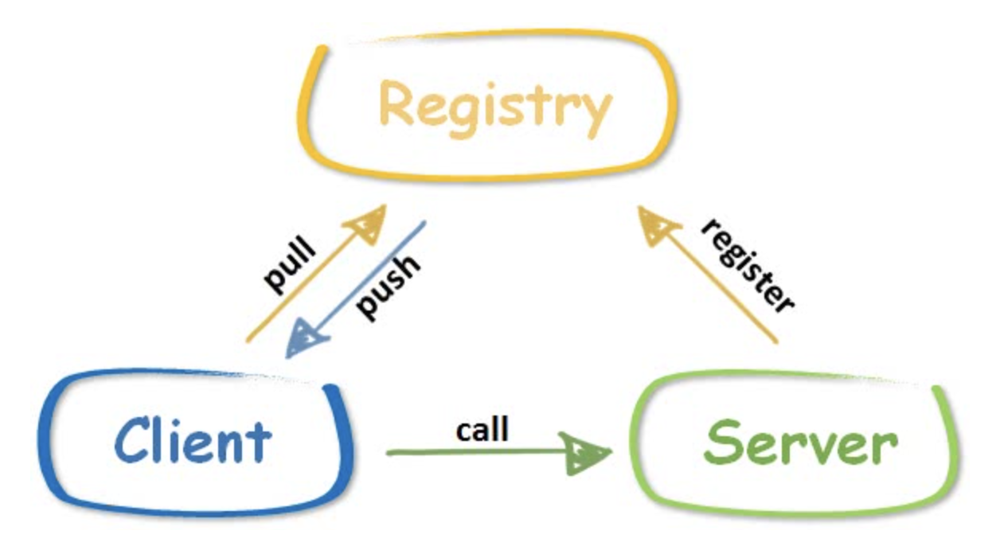

# Day 7

Day6完成了没有注册中心的负载均衡，但实际应用中，服务应该通过注册中心注册，如下图：



这样可以隔离客户端和服务器，双方都只需要感受注册中心的存在即可：

* 服务器向注册中心注册服务；并定期向注册中心发送心跳，确保服务可用
* 客户端向注册中心获得可用服务

主流的注册中心一般有zookeeper，consul等

与这类注册中心对接需要较大量代码，本次实现简单的心跳保活注册中心

------

registry/registry.go

```go
// Registry is a simple register center, provide following functions.
// add a server and receive heartbeat to keep it alive.
// returns all alive servers and delete dead servers sync simultaneously.
type Registry struct {
	timeout time.Duration  // 超时时间
	mu      sync.Mutex // protect following
	servers map[string]*ServerItem //存储服务地址和启动时间
}
type ServerItem struct {
	Addr  string
	start time.Time
}
const (
	defaultPath    = "/_geerpc_/registry" //注册中心的访问地址
	defaultTimeout = time.Minute * 5 //默认5分钟发次心跳包
)
// New create a registry instance with timeout setting 新建一个注册中心
func New(timeout time.Duration) *Registry {
	return &Registry{
		servers: make(map[string]*ServerItem),
		timeout: timeout,
	}
}
var DefaultGeeRegister = New(defaultTimeout)
```

注册中心的主要功能：putserver 注册服务 aliveservers获得所有存活的server

```go
// 注册中心的主要功能为注册服务和发送心跳
func (r *Registry) putServer(addr string) {
   r.mu.Lock()
   defer r.mu.Unlock()
   s := r.servers[addr]
   if s == nil {
      r.servers[addr] = &ServerItem{Addr: addr, start: time.Now()}
   } else {
      s.start = time.Now() // if exists, update start time to keep alive
   }
}

func (r *Registry) aliveServers() []string {
   r.mu.Lock()
   defer r.mu.Unlock()
   var alive []string
   for addr, s := range r.servers { //遍历所有服务
      if r.timeout == 0 || s.start.Add(r.timeout).After(time.Now()) { //未超时
         alive = append(alive, addr)
      } else {
         delete(r.servers, addr) //超时删除
      }
   }
   sort.Strings(alive)
   return alive
}
```

对于这个注册中心，实际上只需要实现一个简单的http服务器(Runs at /_geerpc_/registry)：

注册中心register实现了ServeHTTP方法，对于Get方法，注册中心调用aliveServers()返回服务列表，对于post方法则调用putServer更新服务信息

```go
func (r *Registry) ServeHTTP(w http.ResponseWriter, req *http.Request) {
   switch req.Method {
   case "GET":
      // keep it simple, server is in req.Header
      w.Header().Set("X-Geerpc-Servers", strings.Join(r.aliveServers(), ",")) //返回存活服务
   case "POST":
      // keep it simple, server is in req.Header
      addr := req.Header.Get("X-Geerpc-Server")
      if addr == "" {
         w.WriteHeader(http.StatusInternalServerError)
         return
      }
      r.putServer(addr)// 注册服务
   default:
      w.WriteHeader(http.StatusMethodNotAllowed)
   }
}

// HandleHTTP registers an HTTP handler for GeeRegistry messages on registryPath
func (r *Registry) HandleHTTP(registryPath string) {
   http.Handle(registryPath, r)
   log.Println("rpc registry path:", registryPath)
}

func HandleHTTP() {
   DefaultRegister.HandleHTTP(defaultPath)
}
```

此时这个注册中心就可以正常启动了，服务器通过post注册服务信息到注册中心，客户端到注册中心通过get获取服务列表

然后实现一个服务器可以调用的心跳机制

```go
// 心跳机制
// Heartbeat send a heartbeat message every once in a while
// it's a helper function for a server to register or send heartbeat
func Heartbeat(registry, addr string, duration time.Duration) {
   if duration == 0 {
      // make sure there is enough time to send heart beat
      // before it's removed from registry
      duration = defaultTimeout - time.Duration(1)*time.Minute
   }
   var err error
   err = sendHeartbeat(registry, addr)
   go func() {
      t := time.NewTicker(duration)
      for err == nil {
         <-t.C
         err = sendHeartbeat(registry, addr)
      }
   }()
}

func sendHeartbeat(registry, addr string) error {
   log.Println(addr, "send heart beat to registry", registry)// 向注册中心发送心跳
   httpClient := &http.Client{}
   req, _ := http.NewRequest("POST", registry, nil)
   req.Header.Set("X-Geerpc-Server", addr)
   if _, err := httpClient.Do(req); err != nil {
      log.Println("rpc server: heart beat err:", err)
      return err
   }
   return nil
}
```

------

/xclient/discovery_registry.go

重新构造一下我们的xclient，实现组册中心的客户端的服务发现能力：

主要是修改RegistryDiscovery注册中心的方法

```go
package xclient

import (
   "context"
   "geerpc/client"
   "geerpc/service"
   "io"
   "log"
   "net/http"
   "reflect"
   "strings"
   "sync"
   "time"
)

type XClient struct {
   d       Discovery
   mode    SelectMode
   opt     *service.Option
   mu      sync.Mutex // protect following
   clients map[string]*client.Client
}

type RegistryDiscovery struct {
   *MultiServersDiscovery
   registry   string
   timeout    time.Duration
   lastUpdate time.Time
}
const defaultUpdateTimeout = time.Second * 10

func NewRegistryDiscovery(registerAddr string, timeout time.Duration) *RegistryDiscovery {
   if timeout == 0 {
      timeout = defaultUpdateTimeout
   }
   d := &RegistryDiscovery{
      MultiServersDiscovery: NewMultiServerDiscovery(make([]string, 0)),
      registry:              registerAddr,
      timeout:               timeout,
   }
   return d
}
func (d *RegistryDiscovery) Update(servers []string) error {
   d.mu.Lock()
   defer d.mu.Unlock()
   d.servers = servers
   d.lastUpdate = time.Now()
   return nil
}

func (d *RegistryDiscovery) Refresh() error {
   d.mu.Lock()
   defer d.mu.Unlock()
   if d.lastUpdate.Add(d.timeout).After(time.Now()) {
      return nil
   }
   log.Println("rpc registry: refresh servers from registry", d.registry)
   resp, err := http.Get(d.registry) //获得所有存活服务
   if err != nil {
      log.Println("rpc registry refresh err:", err)
      return err
   }
   servers := strings.Split(resp.Header.Get("X-Geerpc-Servers"), ",")
   d.servers = make([]string, 0, len(servers))
   for _, server := range servers {
      if strings.TrimSpace(server) != "" {
         d.servers = append(d.servers, strings.TrimSpace(server))
      }
   }
   d.lastUpdate = time.Now()
   return nil
}
func (d *RegistryDiscovery) Get(mode SelectMode) (string, error) {
   if err := d.Refresh(); err != nil {
      return "", err
   }
   return d.MultiServersDiscovery.Get(mode)
}

func (d *RegistryDiscovery) GetAll() ([]string, error) {
   if err := d.Refresh(); err != nil {
      return nil, err
   }
   return d.MultiServersDiscovery.GetAll()
}


var _ io.Closer = (*XClient)(nil)

func NewXClient(d Discovery, mode SelectMode, opt *service.Option) *XClient {
   return &XClient{d: d, mode: mode, opt: opt, clients: make(map[string]*client.Client)}
}

func (xc *XClient) Close() error {
   xc.mu.Lock()
   defer xc.mu.Unlock()
   for key, client := range xc.clients {
      // I have no idea how to deal with error, just ignore it.
      _ = client.Close()
      delete(xc.clients, key)
   }
   return nil
}

func (xc *XClient) dial(rpcAddr string) (*client.Client, error) {
   xc.mu.Lock()
   defer xc.mu.Unlock()
   cli, ok := xc.clients[rpcAddr] //rpc服务地址
   if ok && !cli.IsAvailable() {
      _ = cli.Close()
      delete(xc.clients, rpcAddr)
      cli = nil
   }
   if cli == nil {
      var err error
      cli, err = client.XDial(rpcAddr, xc.opt)
      if err != nil {
         return nil, err
      }
      xc.clients[rpcAddr] = cli
   }
   return cli, nil
}

func (xc *XClient) call(rpcAddr string, ctx context.Context, serviceMethod string, args, reply interface{}) error {
   client, err := xc.dial(rpcAddr)
   if err != nil {
      return err
   }
   return client.Call(ctx, serviceMethod, args, reply)
}

// Call invokes the named function, waits for it to complete,
// and returns its error status.
// xc will choose a proper server.
//负载均衡的CALL
func (xc *XClient) Call(ctx context.Context, serviceMethod string, args, reply interface{}) error {
   rpcAddr, err := xc.d.Get(xc.mode)
   if err != nil {
      return err
   }
   return xc.call(rpcAddr, ctx, serviceMethod, args, reply)
}

// Broadcast invokes the named function for every server registered in discovery
func (xc *XClient) Broadcast(ctx context.Context, serviceMethod string, args, reply interface{}) error {
   servers, err := xc.d.GetAll()
   if err != nil {
      return err
   }
   var wg sync.WaitGroup
   var mu sync.Mutex // protect e and replyDone
   var e error
   replyDone := reply == nil // if reply is nil, don't need to set value
   ctx, cancel := context.WithCancel(ctx)
   for _, rpcAddr := range servers { //遍历所有server
      wg.Add(1)
      go func(rpcAddr string) {
         defer wg.Done()
         var clonedReply interface{}
         if reply != nil {
            clonedReply = reflect.New(reflect.ValueOf(reply).Elem().Type()).Interface() //利用反射获得reply的类型
         }
         err := xc.call(rpcAddr, ctx, serviceMethod, args, clonedReply) //进行调用
         mu.Lock()
         if err != nil && e == nil {
            e = err
            cancel() // if any call failed, cancel unfinished calls
         }
         if err == nil && !replyDone {
            reflect.ValueOf(reply).Elem().Set(reflect.ValueOf(clonedReply).Elem())
            replyDone = true
         }
         mu.Unlock()
      }(rpcAddr)
   }
   wg.Wait()
   return e
}
```

------

做一个简单demo 测试一下注册中心：

* 启动注册中心(实际类似个http服务器)，等待连接

* 服务器把服务注册到注册中心；启动心跳机制和注册中心保持通信
* 客户段通过xclient调用对应服务，xclient会到注册中心获取服务列表，根据负载均衡模式选择调用对应的服务器，然后调用对应服务
* 服务器处理响应并回复

```go
package main

import (
   "context"
   "geerpc/registry"
   "geerpc/service"
   "geerpc/xclient"
   "log"
   "net"
   "net/http"
   "sync"
   "time"
)
//服务注册
type Foo int

type Args struct{ Num1, Num2 int }

func (f Foo) Sum(args Args, reply *int) error {
   *reply = args.Num1 + args.Num2
   return nil
}

func (f Foo) Sleep(args Args, reply *int) error {
   time.Sleep(time.Second * time.Duration(args.Num1))
   *reply = args.Num1 + args.Num2
   return nil
}
//启动服务器
func foo(xc *xclient.XClient, ctx context.Context, typ, serviceMethod string, args *Args) {
   var reply int
   var err error
   switch typ {
   case "call":
      err = xc.Call(ctx, serviceMethod, args, &reply)
   case "broadcast":
      err = xc.Broadcast(ctx, serviceMethod, args, &reply)
   }
   if err != nil {
      log.Printf("%s %s error: %v", typ, serviceMethod, err)
   } else {
      log.Printf("%s %s success: %d + %d = %d", typ, serviceMethod, args.Num1, args.Num2, reply)
   }
}

//启动服务器
func startRegistry(wg *sync.WaitGroup) {
   l, _ := net.Listen("tcp", ":9999")
   registry.HandleHTTP()
   wg.Done()
   _ = http.Serve(l, nil)
}

func startServer(registryAddr string, wg *sync.WaitGroup) {
   var foo Foo
   l, _ := net.Listen("tcp", ":0")
   server := service.NewServer()
   _ = server.Register(&foo)
   registry.Heartbeat(registryAddr, "tcp@"+l.Addr().String(), 0)//定时向注册中心发送心跳
   wg.Done()
   server.Accept(l)
}
func call(registry string) {
   d := xclient.NewRegistryDiscovery(registry, 0)
   xc := xclient.NewXClient(d, xclient.RandomSelect, nil)
   defer func() { _ = xc.Close() }()
   // send request & receive response
   var wg sync.WaitGroup
   for i := 0; i < 5; i++ {
      wg.Add(1)
      go func(i int) {
         defer wg.Done()
         foo(xc, context.Background(), "call", "Foo.Sum", &Args{Num1: i, Num2: i * i})
      }(i)
   }
   wg.Wait()
}

func broadcast(registry string) {
   d := xclient.NewRegistryDiscovery(registry, 0)
   xc := xclient.NewXClient(d, xclient.RandomSelect, nil)
   defer func() { _ = xc.Close() }()
   var wg sync.WaitGroup
   for i := 0; i < 5; i++ {
      wg.Add(1)
      go func(i int) {
         defer wg.Done()
         foo(xc, context.Background(), "broadcast", "Foo.Sum", &Args{Num1: i, Num2: i * i})
         // expect 2 - 5 timeout
         ctx, _ := context.WithTimeout(context.Background(), time.Second*2)
         foo(xc, ctx, "broadcast", "Foo.Sleep", &Args{Num1: i, Num2: i * i})
      }(i)
   }
   wg.Wait()
}

func main() {
   log.SetFlags(0)
   registryAddr := "http://localhost:9999/_geerpc_/registry"
   var wg sync.WaitGroup
   wg.Add(1)
   go startRegistry(&wg)  //启动注册中心
   wg.Wait()

   time.Sleep(time.Second)
   wg.Add(2)
   go startServer(registryAddr, &wg)
   go startServer(registryAddr, &wg)
   wg.Wait()

   time.Sleep(time.Second)
   call(registryAddr)
   broadcast(registryAddr)
}
```

------

现在一个简单的rpc框架已经基本成型了

* rpc的基本功能远程调用基于tcp
* server提供服务
* 注册中心存储那些server提供服务
* 客户端向注册中心获得信息 再向服务器调用服务
* 服务器有接受HTTP连接能力
* 简单的负载均衡和服务发现能力
* 通过反射获得参数类型