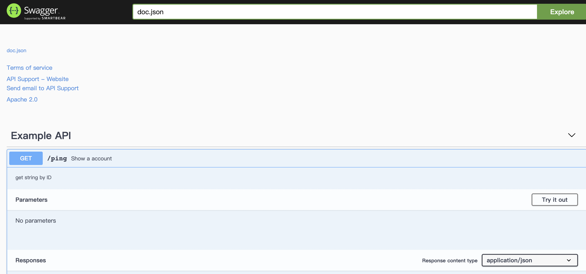

# Go 常用框架学习

[TOC]

#### 日志框架Zap

import  "go.uber.org/zap"

**日志等级分为Debug，Info，Warn，Error，Fatal**

```go
import(
   "go.uber.org/zap"
)
func main(){
   var logger *zap.Logger
   logger,_=zap.NewProduction()
   logger.Debug("this is a debug msg!") // 这行不会打印，因为默认日志级别是 INFO
   logger.Info("this is a Inofo msg!")  // INFO  级别日志，这个会正常打印
   logger.Warn("this is a Warn msg!")// WARN  级别日志，这个会正常打印
   logger.Error("this is a error msg!") // ERROR 级别日志，这个会打印，并附带堆栈信息
   logger.Fatal("this is a fatal msg! I will exit after this log")// FATAL 级别日志，这个会打印，附带堆栈信息，并调用 os.Exit 退出
}
```


**SugaredLogger**

定制日志格式

zap.NewProduction()实际上是创建了一个带了预置配置的 zap.Logger，使用zap.New(core zapcore.Core, options ...Option)可以 来手动传递所有配置项，zapcore.Core需要 3 个配置：

*Encoder*: 编码器，用于告诉 zap 以什么样的形式写入日志。zap 提供了 jsonEncoder 和 consoleEncoder 两种内置的编码器
*WriterSyncer*: 告诉 zap 将日志写到哪里，比如文件(os.File) 或标准输出(os.stdout)
*LevelEnabler:* 用于设置 zap.Logger 的日志级别

```go
var sugaredLogger *zap.SugaredLogger
writer :=zapcore.AddSync(os.Stdout) //日志的输出设备可以是file或标准输出
encoder := zapcore.NewJSONEncoder(zap.NewProductionEncoderConfig())//创建编码格式
core := zapcore.NewCore(encoder,writer,zapcore.DebugLevel)//创建一个core，日志格式
logger:= zap.New(core)
sugaredLogger = logger.Sugar()
sugaredLogger.Debugf("i am debug, using %s", "sugar")   // 这行不会打印，因为默认日志级别是 INFO
sugaredLogger.Infof("i am info, using %s", "sugar")      // INFO  级别日志，这个会正常打印
sugaredLogger.Warnf("i am warn, using %s", "sugar")    // WARN  级别日志，这个会正常打印
sugaredLogger.Errorf("i am error, using %s", "sugar")   // ERROR 级别日志，这个会打印，并附带堆栈信息
sugaredLogger.Fatalf("i am fatal, using %s", "sugar")    // FATAL 级别日志，这个会打印，附带堆栈信息，并调用
```


堆栈和caller信息需要显示的调用才会显示：

```
logger := zap.New(core, zap.AddCaller())  // 增加 caller 信息
```

需要添加其他自定义字段也可以在New的时候添加

	uuid:="test"
	logger := zap.New(core, zap.AddCaller(), zap.Fields(zapcore.Field{  // 添加 uuid 字段
		Key:       "uuid",
		Type:      zapcore.StringType,
		String:    uuid,
	}))


**文件切割**

因为`zap`本身不支持切割归档日志文件，为了添加日志切割归档功能，用第三方库`lumberjack`来实现

```
"github.com/natefinch/lumberjack"
```

修改前面代码中的writer，

```go
var sugaredLogger *zap.SugaredLogger
//lumberjack 修改writer
lumberJackLogger:=&lumberjack.Logger{
   Filename: "./test.log",
   MaxSize: 10,//在进行切割之前，日志文件的最大大小（以MB为单位）
   MaxBackups:5,//旧文件的个数
   MaxAge: 1, //天数
   Compress: false,
}

writer :=zapcore.AddSync(lumberJackLogger) //日志的输出设备可以是file或标准输出
```

服务启动日志是追加不是覆盖

日志格式也可以自定义

```go
writer :=zapcore.AddSync(lumberJackLogger)
//自定义时间格式
config := zapcore.EncoderConfig{
   MessageKey:   "msg",  //结构化（json）输出：msg的key
   LevelKey:     "level",//结构化（json）输出：日志级别的key（INFO，WARN，ERROR等）
   TimeKey:      "ts",   //结构化（json）输出：时间的key（INFO，WARN，ERROR等）
   CallerKey:    "file", //结构化（json）输出：打印日志的文件对应的Key
   EncodeLevel:  zapcore.CapitalLevelEncoder, //将日志级别转换成大写（INFO，WARN，ERROR等）
   EncodeCaller: zapcore.ShortCallerEncoder, //采用短文件路径编码输出（test/main.go:14 ）
   EncodeTime: func(t time.Time, enc zapcore.PrimitiveArrayEncoder) {
      enc.AppendString(t.Format("2006-01-02 15:04:05"))
   },//输出的时间格式
   EncodeDuration: func(d time.Duration, enc zapcore.PrimitiveArrayEncoder) {
      enc.AppendInt64(int64(d) / 1000000)
   },//

}
encoder := zapcore.NewJSONEncoder(config)//创建编码格式
```


#### 配置解决方案框架Viper

Viper是适用于Go应用程序（包括`Twelve-Factor App`）的完整配置解决方案。它被设计用于在应用程序中工作，并且可以处理所有类型的配置需求和格式。

**github.com/spf13/viper**

`viper`提供的配置方式的优先级顺序如下(由高到低)：

- 1.设置显示调用(explicit call to Set)
- 2.命令行标志(flag)
- 3.环境变量(env)
- 4.配置文件(config)
- 5.远程键/值存储(key/value store)
- 6.默认值(default)

使用方式：

定义一个要读取的配置文件：config_text.yaml

```yaml
IpAddr: "127.0.0.1"
Port: 3306
UserName: "root"
Password: 123456
DataBaseName: "go_test"
```

```go
type DBconnection struct{
	IpAddr string
	Port int
	Username string
	Password int
	Dbname string
}
func main{
config := viper.New()
//设置要读取的配置名，不加后缀
config.SetConfigName("config_text")
//设置配置文件路径,可以设置多个搜索路径
config.AddConfigPath("./p1_test")
//设置配置文件类型
config.SetConfigType("yaml")

//读取配置
dbconfig := new(DBconnection)
err := config.ReadInConfig()
if err != nil {
   panic(fmt.Errorf("Fatal error config file: %s \n", err))
}
config.Unmarshal(&dbconfig) //加码配置并存到dbconfig
//打印配置
fmt.Println(dbconfig)
  
}
```

 要让viper持续监控配置实时更新，则在添加config路径后面添加

```go
package main

import(
	"fmt"
	"github.com/fsnotify/fsnotify"
	"github.com/spf13/viper"
	"time"
)
//用于接受配置的数据结构
type DBconnection struct{
	IpAddr string
	Port int
	Username string
	Password int
	Dbname string
}
func main(){
	fmt.Println("test")
	config := viper.New()

	//设置要读取的配置名，不加后缀
	config.SetConfigName("config_text")
	//设置配置文件路径,可以设置多个搜索路径
	config.AddConfigPath("./p1_test")
	//设置配置文件类型
	config.SetConfigType("yaml")
	config.WatchConfig()
	dbconfig := new(DBconnection)
	config.OnConfigChange(func(e fsnotify.Event) {
		//viper配置发生变化了 执行响应的操作
		fmt.Println("Config file changed:", e.Name)
		err := config.ReadInConfig()
		if err != nil {
			panic(fmt.Errorf("Fatal error config file: %s \n", err))
		}
		config.Unmarshal(&dbconfig) //加码配置并存到dbconfig
		//打印配置
		fmt.Println(dbconfig)
	})
	//读取配置

	err := config.ReadInConfig()
	if err != nil {
		panic(fmt.Errorf("Fatal error config file: %s \n", err))
	}
	config.Unmarshal(&dbconfig) //加码配置并存到dbconfig
	//打印配置
	fmt.Println(dbconfig)
	for{
		time.Sleep(1000)
	}
}
```

#### 自动化api文档框架Swagger

[swagger](https://so.csdn.net/so/search?q=swagger) 是一个golang版本的swagger文档生成器，提供了native code包装器，并且支持主流的web框架包裹器

[github](https://so.csdn.net/so/search?q=github) 地址：https://github.com/swaggo/gin-swagger

使用教程：https://blog.csdn.net/weixin_42661321/article/details/108887918

首先需要下载一个文档生成工具swag

go1.17后用

​	go install github.com/swaggo/swag/cmd/swag

mac 适用：

​	export PATH="/Users/你的用户名/go/bin:$PATH"

​	source ~/.zshrc

在Go项目根文件夹中运行Swag

​	在`main.go`所在目录执行 `swag init`

​	执行后，会生成docs/doc.go以及docs/swagger.json,docs/swagger.yaml

Import 两个库

​		swaggerFiles "github.com/swaggo/files" 

​		ginSwagger "github.com/swaggo/gin-swagger"

  * 同时要吧生成的doc也import 进来

    ```go
    _ "github.com/flipped-aurora/gin-vue-admin/server/docs"
    ```

添加必要的注释后重新init

启动服务器后api接口文档可以在localhost:8080/swagger/index.html看到

接口的写法：https://swaggo.github.io/swaggo.io/declarative_comments_format/api_operation.html

https://blog.csdn.net/qq_45100706/article/details/115481714




#### 命令行参数处理库flag 

#### 数据库Gorm

ORM（Object Relation Mapping 关系对象映射），就是把对象模型表示的对象映射到基于SQL的关系模型数据库结构中，在具体的操作实体对象的时候，不需要直接与复杂的 SQL语句打交道，只需简单的操作实体对象的属性和方法。而GORM就是基于Go语言实现的ORM库。在使用Go语言开发项目的时候，我们可以利用GORM来实现对数据库的操作，进行简单的CRUD操作。

依赖：

​	gorm.io/driver/mysql 

​	gorm.io/gorm 

使用gorm打开数据库：

func Open(dialector Dialector, config *Config) (db *DB, err error)

```go
db,err := gorm.Open("mysql","root:bgbiao.top@(127.0.0.1:13306)/test_api?charset=utf8&parseTime=True&loc=Local")
    if err != nil {
        fmt.Errorf("创建数据库连接失败:%v",err)

    }

    defer db.Close()
```

打开数据库后可以利用db进行增改查删

```go
db.AutoMigrate()--自动迁移表
```

#### 验证码框架captcha

```go
"github.com/mojocn/base64Captcha"
```

使用base64编码图片，减少了向服务器请求下载图片的次数，同时也起到了加密的作用

base64Captcha提供几种验证码

1. **dight** 数字验证码
2. **audio** 语音验证码
3. **string** 字符验证码
4. **math** 数学验证码(加减乘除)
5. **chinese**中文验证码-有bug

参数的意义：

可视化各种参数的影响：https://captcha.mojotv.cn/

```go
base64Captcha.DriverMath{     
  Length:          4,     // 验证码长度     
  Height:          30,    // 验证码图片高度     
  Width:           60,    // 验证码图片宽度     
  Source：         "abcd",// 会出现字符      
  NoiseCount:      0,     // 干扰词数量     
  DotCount：       0，    // 干扰点数量     
  MaxSkew：        1，    // 倾斜角度 0-1     
  ShowLineOptions: 2 | 4, // 线条数量     
  BgColor: &color.RGBA{   // 背景颜色             
    R: 128,             
    G: 98,             
    B: 112,             
    A: 0,     
  },    
  Fonts: []string{"3Dumb.ttf"},  // 字体     
  Language：       "zh",  // 音频语言 } 
```

```go
// 开辟一个验证码使用的内存空间，base64Captcha.DefaultMemStore是默认的:10240 个 过期时间10分钟
var store = base64Captcha.DefaultMemStore
// 生成默认数字的driver
driver := base64Captcha.DefaultDriverDigit
// 也可以自定义参数
//base64Captcha.NewDriverDigit(height , width , length , maxSkew , dotCount)
//生成验证码，同时保存至store
c := base64Captcha.NewCaptcha(driver, store)
//生成base64图像和id
id, b64s, err := c.Generate()

//验证验证码正确性，注意：id,b64s是空 也会返回true 需要在加判断；true应该是验证完会把这个验证码从store中删去
store.Verify(id, b64s, true) 
```

#### goroutine控制

https://www.flysnow.org/2017/05/12/go-in-action-go-context.html


#### web后台框架gin

https://www.topgoer.com/gin%E6%A1%86%E6%9E%B6/

```
github.com/gin-gonic/gin

```

* 参数获取：

```go

获取路径参数
router.GET("/user/:name", func(c *gin.Context) {
		name := c.Param("name")
		c.String(http.StatusOK, "Hello %s", name)
	})
获取get参数
router.GET("/welcome", func(c *gin.Context) {
		firstname := c.DefaultQuery("firstname", "Guest")
		lastname := c.Query("lastname") // 是 c.Request.URL.Query().Get("lastname") 的简写

		c.String(http.StatusOK, "Hello %s %s", firstname, lastname)
	})
获取post参数
router.POST("/form_post", func(c *gin.Context) {
		message := c.PostForm("message")
		nick := c.DefaultPostForm("nick", "anonymous") // 此方法可以设置默认值
		c.JSON(200, gin.H{
			"status":  "posted",
			"message": message,
			"nick":    nick,
		})
	})
上传文件
//限制上传最大尺寸
	r.MaxMultipartMemory = 8 << 20
	r.POST("/upload", func(c *gin.Context) {
		file, err := c.FormFile("file") //key的名字为file
		if err != nil {
			c.String(500, "上传图片出错")
		}
		// c.JSON(200, gin.H{"message": file.Header.Context})
		fmt.Println(file.Filename)
		c.SaveUploadedFile(file, file.Filename)
		c.String(http.StatusOK, file.Filename)
	})
多文件用value提取文本，File提取文件：
r.POST("/upload", func(c *gin.Context) {
		form, err := c.MultipartForm()
		if err != nil {
			c.String(http.StatusBadRequest, fmt.Sprintf("get err %s", err.Error()))
		}
		// 获取所有图片
		files := form.File["files"]
		text :=form.Value["text"]
		// 遍历所有图片
		for _, file := range files {
			// 逐个存

			if err := c.SaveUploadedFile(file, file.Filename); err != nil {
				c.String(http.StatusBadRequest, fmt.Sprintf("upload err %s", err.Error()))
				return
			}
		}
		fmt.Println("a:",text)
		c.String(200, fmt.Sprintf("upload ok %d files", len(files)))
	})
```

* 路由分组

```go
 r := gin.Default()
   // 路由组1 ，处理GET请求
v1 := r.Group("/v1")
   // {} 是书写规范
   {
      v1.GET("/login", login)
      v1.GET("submit", submit)
   }
 v2 := r.Group("/v2")
   {
      v2.POST("/login", login)
      v2.POST("/submit", submit)
   }

这样可以分别访问/v1/login，/v2/login
```

路由拆分：当项目规模大起来的时候最好把不同模块的路由分到不同文件中去

```
gin
├── go.mod
├── go.sum
├── main.go
└── routers
    ├── blog.go
    └── shop.go
```

```go
router文件夹下：
shop.go
func LoadShop(e *gin.Engine)  {
  e.GET("/hello", helloHandler)
  e.GET("/goods", goodsHandler)
  e.GET("/checkout", checkoutHandler)
  ...
}
blog.go
func LoadBlog(e *gin.Engine) {
  e.GET("/post", postHandler)
  e.GET("/comment", commentHandler)
  ...
}
根目录下
main.go
func main() {
    r := gin.Default()
    routers.LoadBlog(r)//r的类型是gin.Engine的指针
    routers.LoadShop(r)
    if err := r.Run(); err != nil {
        fmt.Println("startup service failed, err:%v\n", err)
    }
}
```

当规模更大时，拆分成不同app，存放不同业务，需要使用时注册到router中

```
gin_demo
├── app
│   ├── app1
│   │   ├── handler.go
│   │   └── router.go
│   └── app2
│       ├── handler.go
│       └── router.go
├── go.mod
├── go.sum
├── main.go
└── routers
    └── routers.go
```

```go
app1/handler
package app1.go
import (
   "fmt"
   "github.com/gin-gonic/gin"
)

func postHandler(c *gin.Context){
   fmt.Println("this is postHandler")
}
func commentHandler(c *gin.Context){
   fmt.Println("this is commentHandler")
}
app1/router.go
package app1

import "github.com/gin-gonic/gin"

func Routers(e *gin.Engine) {
	e.GET("/post", postHandler) 
	e.GET("/comment", commentHandler)
}
app2/handler.go
package app2

import (
	"fmt"
	"github.com/gin-gonic/gin"
)

func goodsHandler(c *gin.Context){
	fmt.Println("this is postHandler")
}
func checkoutHandler(c *gin.Context){
	fmt.Println("this is commentHandler")
}

app2/router.go
package app2

import "github.com/gin-gonic/gin"

func Routers(e *gin.Engine) {
	e.GET("/goods", goodsHandler)
	e.GET("/checkout", checkoutHandler)
}
routers/routers.go
package routers

import "github.com/gin-gonic/gin"

type Option func(*gin.Engine) //函数指针

var options = []Option{} //函数指针数组

// 注册app的路由配置
func Include(opts ...Option) {
	options = append(options, opts...)
}

// 初始化
func Init() *gin.Engine {
	r := gin.New() //r的类型是gin.Engine
	for _, opt := range options {
		opt(r) //调用option指向的函数，即不同app的router函数，从而注册路由到r上
	}
	return r
}
main.go
package main

import (
	"fmt"
	"gin/app/app1"
	"gin/app/app2"
	"gin/routers"
)

func main() {
	// 加载多个APP的路由配置
	routers.Include(app1.Routers, app2.Routers) //注册指定app的路由
	// 初始化路由
	r := routers.Init()
	if err := r.Run(); err != nil {
		fmt.Println("startup service failed, err:%v\n", err)
	}
	r.Run()
}
```

* 数据绑定与解析：

* 反引号的作用-Tag：

​		由反引号包含，由一对或几对的键值对组成，通过空格来分割键值，在把结构体编码成不同格式时会以不同格式匹配对应的key和value--即在转换成其它数据格式的时候，会使用其中特定的字段作为键值

```go
type Human struct {
Name   string  `json:"english_name"` //把struct编码成json字符串时，Name字段的key是english_name，而不是Name
Age    int     `json:"-"`            //把struct编码成json字符串时，会忽略Age这个字段
Weight float64 //`json:",string"` //编码成字符串，这个string选项只适用字符串，浮点型和整型数据
}
```
```go
/ 定义接收数据的结构体
type Login struct {
   // binding:"required"修饰的字段，若接收为空值，则报错，是必须字段
   User    string `form:"username" json:"user" uri:"user" xml:"user" binding:"required"`
   Pssword string `form:"password" json:"password" uri:"password" xml:"password" binding:"required"`
}
func main() {
   // 1.创建路由
   // 默认使用了2个中间件Logger(), Recovery()
   r := gin.Default()
   // JSON绑定
   r.POST("loginJSON", func(c *gin.Context) {
      // 声明接收的变量
      var json Login
     // 将request的body中的数据，自动按照json格式解析到结构体 用C.Bind()会自动根据类型解析
      if err := c.ShouldBindJSON(&json); err != nil {
         // 返回错误信息
         // gin.H封装了生成json数据的工具
         c.JSON(http.StatusBadRequest, gin.H{"error": err.Error()})
         return
      }
      // 判断用户名密码是否正确
      if json.User != "root" || json.Pssword != "admin" {
         c.JSON(http.StatusBadRequest, gin.H{"status": "304"})
         return
      }
      c.JSON(http.StatusOK, gin.H{"status": "200"})
   })
   r.Run(":8000")
}
```

* Html渲染：

- LoadHTMLGlob()方法可以加载模板文件并进行变量替换

```go
package main

import (
    "net/http"

    "github.com/gin-gonic/gin"
)

func main() {
    r := gin.Default()
    r.LoadHTMLGlob("tem/*")
    r.GET("/index", func(c *gin.Context) {
        c.HTML(http.StatusOK, "index.html", gin.H{"title": "我是测试", "ce": "123456"})
    })
    r.Run()
}
```

* 重定向

```go
package main

import (
    "net/http"

    "github.com/gin-gonic/gin"
)

func main() {
    r := gin.Default()
    r.GET("/index", func(c *gin.Context) {
        c.Redirect(http.StatusMovedPermanently, "http://www.5lmh.com")
    })
    r.Run()
}
```

* 中间件：

```go
// 默认使用了2个中间件Logger(), Recovery()
    r := gin.Default()
    // 注册中间件
    r.Use(myTime) --注册中间件，这样每次有request都会执行myTime中间件定义的handler
```

```go
package main

import (
    "fmt"
    "time"

    "github.com/gin-gonic/gin"
)

// 定义中间
func myTime(c *gin.Context) {
    start := time.Now()
    c.Next() //会让程序先去执行其他中间件和后续代码，最后在回到这里统计运行用时
    // 统计时间
    since := time.Since(start)
    fmt.Println("程序用时：", since)
}

func main() {
    // 1.创建路由
    // 默认使用了2个中间件Logger(), Recovery()
    r := gin.Default()
    // 注册中间件
    r.Use(myTime)
    // {}为了代码规范
    shoppingGroup := r.Group("/shopping")
    {
        shoppingGroup.GET("/index", shopIndexHandler)
        shoppingGroup.GET("/home", shopHomeHandler)
    }
    r.Run(":8000")
}

func shopIndexHandler(c *gin.Context) {
    time.Sleep(5 * time.Second)
}

func shopHomeHandler(c *gin.Context) {
    time.Sleep(3 * time.Second)
}
```

一些推荐的中间件使用：

https://www.topgoer.com/gin%E6%A1%86%E6%9E%B6/gin%E4%B8%AD%E9%97%B4%E4%BB%B6/%E4%B8%AD%E9%97%B4%E4%BB%B6%E6%8E%A8%E8%8D%90.html

鉴权，限流等功能可以用中间件实现

------

* 会话控制：

cookie

```go
package main

import (
   "github.com/gin-gonic/gin"
   "fmt"
)

func main() {
   // 1.创建路由
   // 默认使用了2个中间件Logger(), Recovery()
   r := gin.Default()
   // 服务端要给客户端cookie
   r.GET("cookie", func(c *gin.Context) {
      // 获取客户端是否携带cookie
      cookie, err := c.Cookie("key_cookie")
      if err != nil {
         cookie = "NotSet"
         // 给客户端设置cookie
         //  maxAge int, 单位为秒
         // path,cookie所在目录
         // domain string,域名
         //   secure 是否智能通过https访问
         // httpOnly bool  是否允许别人通过js获取自己的cookie
         c.SetCookie("key_cookie", "value_cookie", 60, "/",
            "localhost", false, true)
      }
      fmt.Printf("cookie的值是： %s\n", cookie)
   })
   r.Run(":8000")
}
```

Cookie认证测试：

```go
package main

import (
   "github.com/gin-gonic/gin"
   "net/http"
)

func AuthMiddleWare() gin.HandlerFunc {
   return func(c *gin.Context) {
      // 获取客户端cookie并校验
      if cookie, err := c.Cookie("abc"); err == nil {
         if cookie == "123" {
            c.Next()
            return
         }
      }
      // 返回错误
      c.JSON(http.StatusUnauthorized, gin.H{"error": "err"})
      // 若验证不通过，不再调用后续的函数处理
      c.Abort()
      return
   }
}

func main() {
   // 1.创建路由
   r := gin.Default()
   r.GET("/login", func(c *gin.Context) {
      // 设置cookie
      c.SetCookie("abc", "123", 60, "/",
         "localhost", false, true)
      // 返回信息
      c.String(200, "Login success!")
   })
   r.GET("/home", AuthMiddleWare(), func(c *gin.Context) {
     //AuthMiddleWare() 局部中间件--访问home前先确认cookier是否正确
      c.JSON(200, gin.H{"data": "home"})
   })
   r.Run(":8000")
}
```

Session

"github.com/gorilla/sessions"

验证码：

github.com/dchest/captcha

这个库利用session进行验证--提供一个路由，先在session里写入键值对（k->v），把值写在图片上，然后生成图片，显示在浏览器上面，前端将图片中的内容发送给后后端，后端根据session中的k取得v，比对校验。如果通过继续下一步的逻辑，失败给出错误提示

验证图片的html：index.html

```html
<!DOCTYPE html>
<html lang="en">
<head>
    <meta charset="UTF-8">
    <title>www.topgoer.com验证码</title>
</head>
<body>

</body>
</html>
```

验证程序：

```go
package main

import (
   "bytes"
   "fmt"
   "github.com/dchest/captcha"
   "github.com/gin-contrib/sessions"
   "github.com/gin-contrib/sessions/cookie"
   "github.com/gin-gonic/gin"
   "net/http"
   "strconv"
   "time"
)

// 中间件，处理session
func Session(keyPairs string) gin.HandlerFunc {
   store := SessionConfig()
   return sessions.Sessions(keyPairs, store)
}
func SessionConfig() sessions.Store {
   sessionMaxAge := 3600
   sessionSecret := "topgoer"
   var store sessions.Store
   store = cookie.NewStore([]byte(sessionSecret))
   store.Options(sessions.Options{
      MaxAge: sessionMaxAge, //seconds
      Path:   "/",
   })
   return store
}

func Captcha(c *gin.Context, length ...int) {
   l := captcha.DefaultLen
   w, h := 107, 36
   if len(length) == 1 {
      l = length[0]
   }
   if len(length) == 2 {
      w = length[1]
   }
   if len(length) == 3 {
      h = length[2]
   }
   captchaId := captcha.NewLen(l)
   fmt.Println("captchaId:"+captchaId)

   session := sessions.Default(c) //生成一个seesion
   session.Set("captcha", captchaId) //设置session k-v对
   _ = session.Save() //存储session
   _ = Serve(c.Writer, c.Request, captchaId, ".png", "zh", false, w, h)//返回一张图片
}
func CaptchaVerify(c *gin.Context, code string) bool {
   session := sessions.Default(c)
   if captchaId := session.Get("captcha"); captchaId != nil {
      session.Delete("captcha")
      _ = session.Save()
      fmt.Println("captchaId.(string):"+captchaId.(string))
      res := captcha.VerifyString(captchaId.(string), code)
      fmt.Println("compare:"+strconv.FormatBool(res))
      if res {
         return true
      } else {
         return false
      }
   } else {
      return false
   }
}
func Serve(w http.ResponseWriter, r *http.Request, id, ext, lang string, download bool, width, height int) error {
   w.Header().Set("Cache-Control", "no-cache, no-store, must-revalidate")
   w.Header().Set("Pragma", "no-cache")
   w.Header().Set("Expires", "0")

   var content bytes.Buffer
   switch ext {
   case ".png":
      w.Header().Set("Content-Type", "image/png")
      _ = captcha.WriteImage(&content, id, width, height) //把id写到图片中去
   case ".wav":
      w.Header().Set("Content-Type", "audio/x-wav")
      _ = captcha.WriteAudio(&content, id, lang)
   default:
      return captcha.ErrNotFound
   }

   if download {
      w.Header().Set("Content-Type", "application/octet-stream")
   }
   http.ServeContent(w, r, id+ext, time.Time{}, bytes.NewReader(content.Bytes()))
   return nil
}

func main() {
   router := gin.Default()
   router.LoadHTMLGlob("./*.html")
   router.Use(Session("topgoer"))
   router.GET("/captcha", func(c *gin.Context) {
      Captcha(c, 4)
   })//更新验证码，生存一个kev-value对，value为图片内容，value长度为4
   router.GET("/", func(c *gin.Context) {
      c.HTML(http.StatusOK, "index.html", nil)
   })//访问根结点显示验证图片
   router.GET("/captcha/verify/:value", func(c *gin.Context) {
      //获得路径参数value，并进行验证
      value := c.Param("value")
      fmt.Println(value)
      if CaptchaVerify(c, value) {
         c.JSON(http.StatusOK, gin.H{"status": 0, "msg": "success"})
      } else {
         c.JSON(http.StatusOK, gin.H{"status": 1, "msg": "failed"})
      }
   })
   router.Run(":8080")
}
```

另一种验证方式是令牌token：

​	JSON Web令牌（JWT）作为令牌系统而不是在每次请求时都发送用户名和密码，因此比其他方法（如基本身份验证）具有固有的优势。

Signature部分的生成需要base64编码之后的Header,base64编码之后的Payload,密钥（secret）--服务端唯一,Header需要指定签字的算法。

```
HMACSHA256(
  base64UrlEncode(header) + "." +
  base64UrlEncode(payload),
  secret)
```


```go
package main

import (
    "fmt"
    "net/http"
    "time"

    "github.com/dgrijalva/jwt-go"
    "github.com/gin-gonic/gin"
)

//自定义一个字符串
var jwtkey = []byte("www.topgoer.com")
var str string

type Claims struct {
    UserId uint
    jwt.StandardClaims
}

func main() {
    r := gin.Default()
    r.GET("/set", setting)
    r.GET("/get", getting)
    //监听端口默认为8080
    r.Run(":8080")
}

//颁发token
func setting(ctx *gin.Context) {
    expireTime := time.Now().Add(7 * 24 * time.Hour)
    claims := &Claims{
        UserId: 2,
        StandardClaims: jwt.StandardClaims{
            ExpiresAt: expireTime.Unix(), //过期时间
            IssuedAt:  time.Now().Unix(),
            Issuer:    "127.0.0.1",  // 签名颁发者
            Subject:   "user token", //签名主题
        },
    }
    token := jwt.NewWithClaims(jwt.SigningMethodHS256, claims)
    // fmt.Println(token)
    tokenString, err := token.SignedString(jwtkey)
    if err != nil {
        fmt.Println(err)
    }
    str = tokenString
    ctx.JSON(200, gin.H{"token": tokenString})
}

//解析token
func getting(ctx *gin.Context) {
    tokenString := ctx.GetHeader("Authorization")
    //vcalidate token formate
    if tokenString == "" {
        ctx.JSON(http.StatusUnauthorized, gin.H{"code": 401, "msg": "权限不足"})
        ctx.Abort()
        return
    }

    token, claims, err := ParseToken(tokenString)
    if err != nil || !token.Valid {
        ctx.JSON(http.StatusUnauthorized, gin.H{"code": 401, "msg": "权限不足"})
        ctx.Abort()
        return
    }
    fmt.Println(111)
    fmt.Println(claims.UserId)
}

func ParseToken(tokenString string) (*jwt.Token, *Claims, error) {
    Claims := &Claims{}
    token, err := jwt.ParseWithClaims(tokenString, Claims, func(token *jwt.Token) (i interface{}, err error) {
        return jwtkey, nil
    })
    return token, Claims, err
}
```

