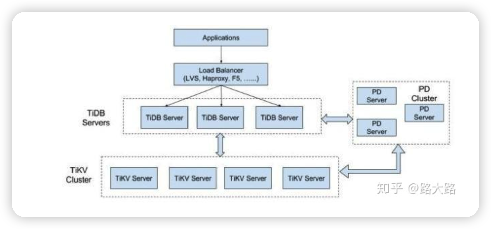
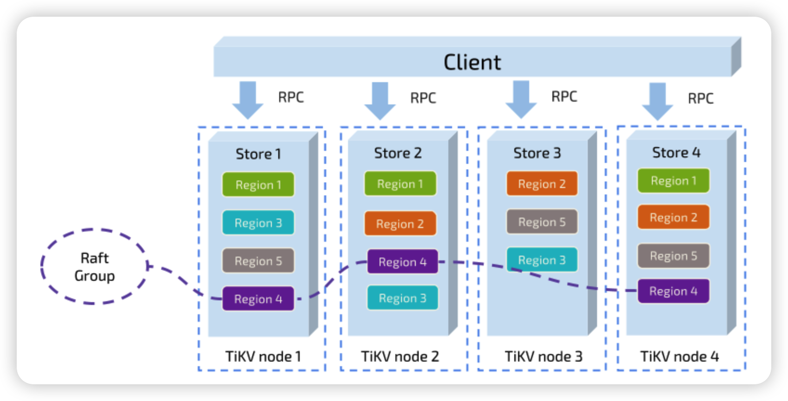
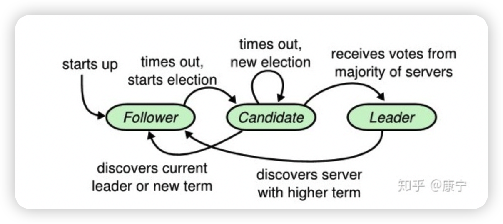
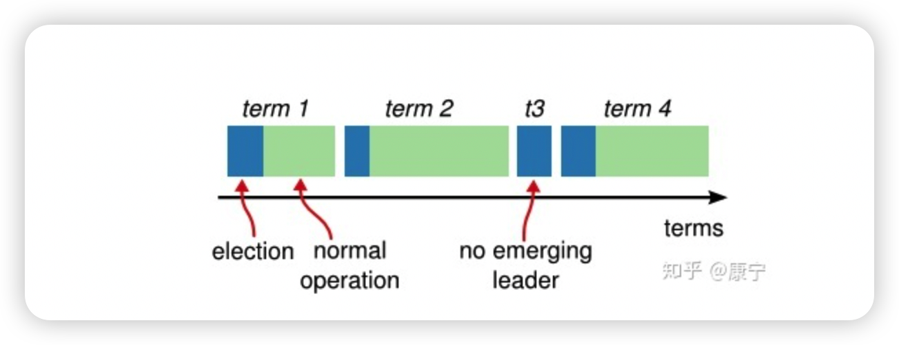
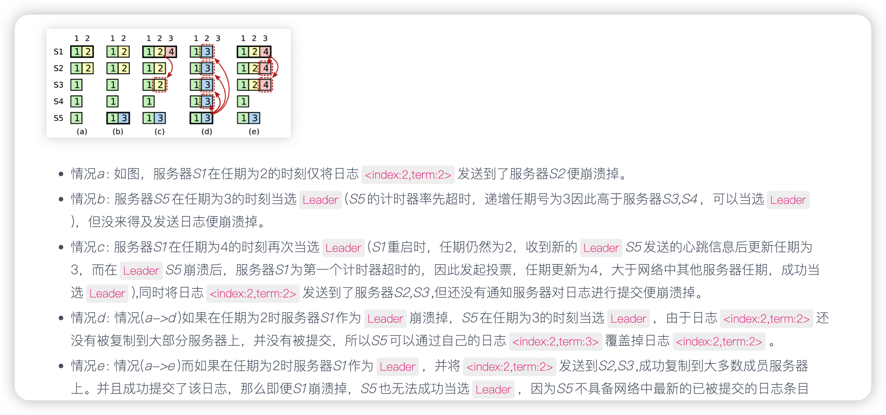
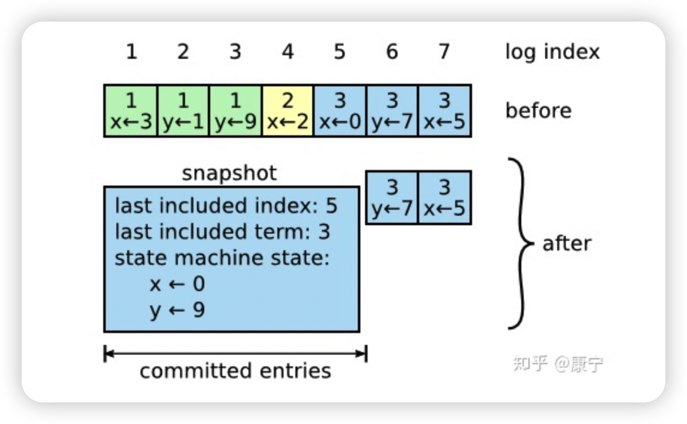

# 什么是TiDB

TiDB是一个分布式数据库，兼容mysql，具有数据强一致和高可用性；

适用场景：OLTP,OLAP

* TiDB架构

TIDB server层：是一层无状态的SQL层，兼容mysql语法。可以解析用户的sql语句，生成分布式的Querry，翻译成底层的key value操作发送给TiKV；TIDB本身并不存储数据，只负责计算，所以可以无限水平扩展，可以通过负载均衡组件（如LVS、HAProxy 或 F5）对外提供统一的接入地址

PD server：Placement Driver (简称 PD) 是整个集群的管理模块。其主要工作有三个： 一是存储集群的元信息（某个 Key 存储在哪个 TiKV 节点）；二是对 TiKV 集群进行调度和负载均衡（如数据的迁移、Raft group leader 的迁移等）；三是分配全局唯一且递增的事务 ID。 PD 是一个集群，需要部署奇数个节点，一般线上推荐至少部署 3 个节点。

TiKV：是数据存储的的地方，是一个分布式的KV数据库;从外部看 TiKV 是一个分布式的提供事务的 Key-Value 存储引擎。存储数据的基本单位是 Region，每个 Region 负责存储一个 Key Range （从 StartKey 到 EndKey 的左闭右开区间）的数据，每个 TiKV 节点会负责多个 Region 。TiKV 使用 `Raft` 协议做复制，保持数据的一致性和容灾。副本以 Region 为单位进行管理，不同节点上的多个 Region 构成一个 Raft Group，互为副本。数据在多个 TiKV 之间的负载均衡由 PD 调度，这里也是以 Region 为单位进行调度。 

存储结构：

一个 Region 的多个 Replica 会保存在不同的节点上，构成一个 Raft Group。其中一个 Replica 会作为这个 Group 的 Leader，其他的 Replica 作为 Follower。所有的读和写都是通过 Leader 进行，再由 Leader 复制给 Follower。

* 相关资源

  [中文介绍](https://docs.pingcap.com/zh/tidb/v4.0)

* Raft协议理解

  1、分布式一致性算法

  * 三个部分：leader选举；日志复制，安全问题

  * 三个角色：leader，follower，candidate

    * 正常情况下：一台服务器为leader，其余为follower；client请求只能达到leader这里来处理	

      

      算法开始时，所有机器都是`follower`，在timeout时间内没有收到`leader`消息，触发选举，变为`candidate`

      某一个`candidate`收到绝大多数的选票，变为`leader`

      其他`Candidate`发现新的`leader`已经产生，变为`follower`

      如果timeout时间没有选出leader，则重新选举

  * 重要概念：

    * Term：任期--每一个term都从新的选举开始，candidate们会努力争取称为leader。一旦获胜，它就会在剩余的term时间内保持leader状态，在某些情况下(如term3)选票可能被多个candidate瓜分，形不成多数派，因此term可能直至结束都没有leader，下一个term很快就会到来重新发起选举。

      

      * leader选举

        Raft通过心跳机制发起leader选举。节点都是从follower状态开始的，如果收到了来自leader或candidate的RPC，那它就保持follower状态，避免争抢成为candidate。Leader会发送空的AppendEntries RPC作为心跳信号来确立自己的地位，如果follower一段时间`(election timeout)`没有收到心跳，它就会认为leader已经挂了，发起新的一轮选举。

        选举发起后，一个follower会增加自己的当前term编号并转变为candidate。它会首先投自己一票，然后向其他所有节点并行发起RequestVote RPC，之后candidate状态将可能发生如下三种变化:

        - **赢得选举,成为leader**: 如果它在一个term内收到了大多数的选票，将会在接下的剩余term时间内称为leader，然后就可以通过发送心跳确立自己的地位。(每一个server在一个term内只能投一张选票，并且按照先到先得的原则投出)
  
        - **其他server成为leader：**在等待投票时，可能会收到其他server发出AppendEntries RPC心跳信号，说明其他leader已经产生了。这时通过比较自己的term编号和RPC过来的term编号，如果比对方大，说明leader的term过期了，就会拒绝该RPC,并继续保持候选人身份; 如果对方编号不比自己小,则承认对方的地位,转为follower.
  
        - **选票被瓜分,选举失败:** 如果没有candidate获取大多数选票, 则没有leader产生, candidate们等待超时后发起另一轮选举. 为了防止下一次选票还被瓜分,必须采取一些额外的措施, raft采用随机election timeout的机制防止选票被持续瓜分。通过将timeout随机设为一段区间上的某个值, 因此很大概率会有某个candidate率先超时然后赢得大部分选票.
  
          [选举过程](https://www.cnblogs.com/cbkj-xd/p/12150282.html)
  
      * 日志复制
  
        Leader选举完成后，集群就可以对客户端提供服务了。
  
        日志的状态分为两种:未被提交，已被提交(日志为安全的，不会被删除或覆盖)。
  
        1、正常情况下
  
        客户端提交的每一条命令会由leader记录到日志当中，包含任期号和索引(任期号为当前`Leader`所处的任期号，索引号为当前`Leader`本地存储的日志集合中的日志的最高索引号加1)。然后通过向follower发送AppendEntries RPC用以复制命令。当复制成功也就是大多数节点成功复制后，Leader会：
  
        * 将该日志应用到`Leader`本地的复制状态机
        * 向所有`Follower`发送消息通知所有接收到该日志的`Follower`将该日志进行提交，然后应用到各自本地的复制状态机
        * 将执行结果通知客户端
        * 而网络中有些`Follower`可能由于网络状态原因反应缓慢或者崩溃，那么`Leader`将会无限次地尝试重复发送`AppendEntries RPC`消息到该`Follower`。直到成功为止。
  
        Follower在接受到消息时也会进行一致性检查：
  
        在`Leader`创建的`AppendEntries RPC`消息中会包含当前日志之前日志条目的任期号与索引号。如果匹配不到则会拒绝执行
  
        2、特殊情况
  
        
  
        
  
        * follower 缺失Leader的消息
        * Follower存在Leader没有的消息(比如旧的`Leader`仅仅将`AppendEntries RPC`消息发送到一部分`Follower`就崩溃掉，然后新的当选`Leader`的服务器恰好是没有收到该`AppendEntries RPC`消息的服务器)
        * Follower既存在Leader没有的消息，有缺失Leader的消息
  
        如a,b满足第一种情况，Follower可能崩溃没有收到leader的RPC消息
  
        如c,d在前一个任期中为Leader（c是6，d是7），他们发送的RPC消息没有发送到所有的follower上就崩溃了，而新的leader刚好是没收到消息的，所以c，d会比leader多几条消息
  
        e，f类似第二种情况，同时新leader发送的消息也没有收到
  
        解决方法：`Leader`通过强迫`Follower`的日志重复自己的日志来处理不一致之处。这意味着`Follower`日志中的冲突日志将被`Leader`日志中的条目覆盖。因此`Leader`必须找到与`Follower`最开始日志发生冲突的位置,然后删除掉`Follower`上所有与`Leader`发生冲突的日志。然后将自己的日志发送给`Follower`以解决冲突。
  
        
  
      * 日志压缩
  
        Raft通过快照进行日志压缩
  
        
  
        每一个server都有自己的snapshot，它只保存当前状态，如上图中的当前状态为x=0,y=9，而last included index和last included term代表snapshot之前最新的命令，用于AppendEntries的状态检查。
  
        虽然每一个server都保存有自己的snapshot，但是当follower严重落后于leader时，leader需要把自己的snapshot发送给follower加快同步，此时用到了一个新的RPC：InstallSnapshot RPC。follower收到snapshot时，需要决定如何处理自己的日志，如果收到的snapshot包含有更新的信息，它将丢弃自己已有的日志，按snapshot更新自己的状态，如果snapshot包含的信息更少，那么它会丢弃snapshot中的内容，但是自己之后的内容会保存下来。
  
      
